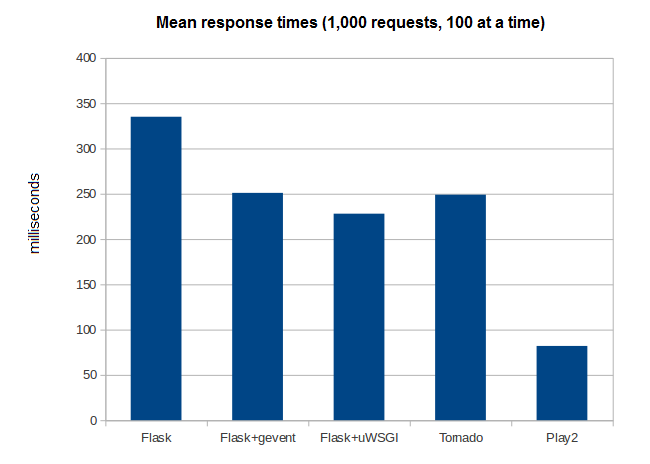

# benchmarks

Results generated using the Apache Benchmark tool. Summary of JSON serialization over HTTP from:

* flask
* flask + gevent
* flask + uwsgi
* tornado
* play2



Sample GET request serializing JSON over HTTP:
```
$ curl http://54.69.100.107:5000/api/rest/status
{
  "DgmsInstanceId": "dgms-service-0000"
}
```

Sample benchmark command (1000 requests, 100 at a time):
```
$ ab -n 1000 -c 100 http://54.69.100.107:5000/api/rest/status
```

Inspired by [TechEmpower Benchmarks](https://www.techempower.com/benchmarks/)
